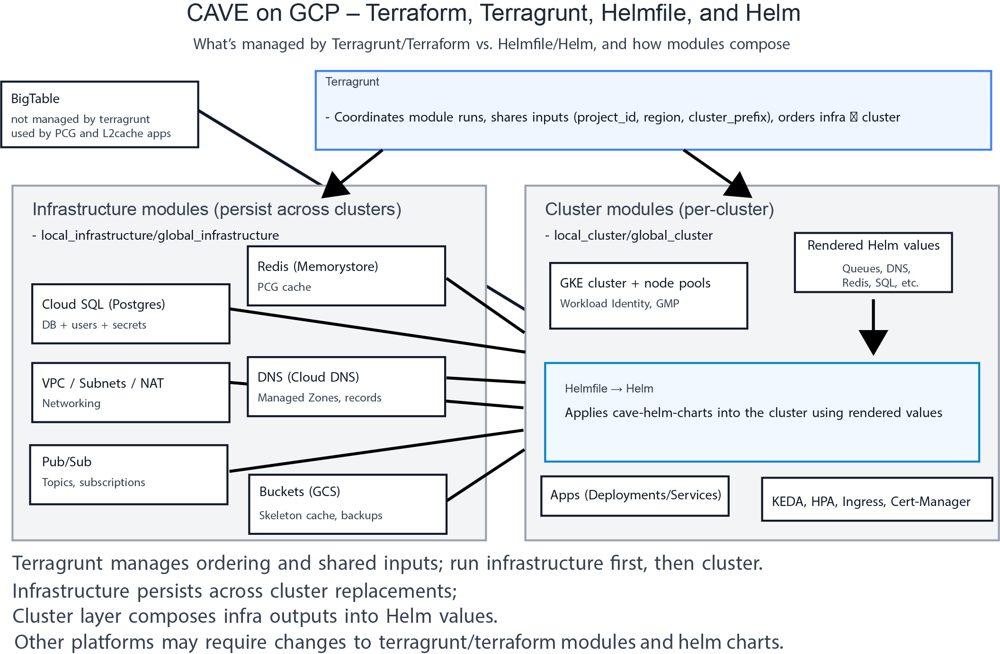

# CAVE on GCP – Migration from CAVEdeployment

This guide describes how to migrate an existing CAVE system to  a CAVE environment managed with Terragrunt and Helmfile.

In contrast to QUICKSTART.md this will assume you have a fully functioning local and global cluster, and want to spin up new clusters that utilize the new infrastructure. 

At a glance:
- Terragrunt + Terraform: provisions everything outside Kubernetes (SQL, Redis, networks, DNS, Pub/Sub, buckets, service accounts, IAM).
- Helmfile + Helm: deploys CAVE apps into Kubernetes using values generated by the Terraform modules.
- Helm charts live in the companion repo: https://github.com/CAVEconnectome/cave-helm-charts

Here's an overview picture of the architecture and where various things live within it. 


## Prerequisites
- macOS with Homebrew
- Install tools:
  - `brew install terraform terragrunt kubectl helm helmfile jq direnv sops gitleaks`
- Authenticate:
  - `gcloud auth login`
  - `gcloud auth application-default login`
  - `gcloud config set project <PROJECT_ID>`

we assume you have google cloud sdk installed but if you didn't
- `brew install --cask google-cloud-sdk`

## Enable APIs
These services are likely already enabled on your project, but secretmanager was not used in CAVEdeployment style deployments.
Re-enabling services won't break anything.
```
gcloud services enable \
  compute.googleapis.com container.googleapis.com dns.googleapis.com \
  redis.googleapis.com sqladmin.googleapis.com secretmanager.googleapis.com \
  iam.googleapis.com cloudresourcemanager.googleapis.com
```

## Create Terraform state bucket
This is where the state of the current deployment(s) will be stored, everyone who is going to be using terragrunt/terraform will need to have read and write access to this bucket. 

To create the bucket you can use this line, but you'll have to add permissions on the bucket separately using the command line or cloud console. 
```
gsutil mb -l us gs://<STATE_BUCKET>
```


## Environment repository
We reccomend that you setup a seperate repository to store all your environment configurations. So make a new folder that you will store and track these files. This is the equivalent to the ENV_REPO that was specified in your CAVEdeployment environment.  However, unlike the environment files, we have tried to design this repo so that no sensitive data is stored in this repository, so it can be developed in the open. We will refer to this location as ENVIRONMENTS_REPO in this documentation.

You can see an example repository at https://www.github.com/CAVEconnectome/terraform-cave-private which is used to manage several cave deployments (3 global, and 6 local clusters).


## Generate a starter local environment with Cookiecutter
We would reccomend migrating a local cluster first, before a global one as you'll get the most value out of managing regular updates to services.  You can continue to manage your global cluster using CAVEdeployment, as they have no real interactions. 

install cookiecutter however you would like (for example)
```
pipx install cookiecutter  # or pip install --user cookiecutter
```

copy the example cookiecutter template file from this repository (example-local-config-migrate.yaml) into ENVIRONMENTS_REPO and rename it to something (we will refer to this as ENV_CONFIG.yaml).   Many of the values of this file are environment variables that were present in the old bash script environment files (located at OLD_ENV_REPO/OLD_ENV_FILE.sh), so you can automate filling this file in by sourcing that environment and running envsubst. Or you can rename it and fill in the value manually. 

```
cd 
source OLD_ENV_REPO/OLD_ENV_FILE.sh
envsubst < example-local-config-migrate.yaml > ENV_CONFIG.yaml

```
You should read over the result, particular attention should be made to:
- local_cluster_prefix: you need to fill in a value here that is a new prefix for this cluster, because you don't want the old cluster to stop working immediately, you want to get the new cluster up and running and then redirect traffic to it once it is fully functional.  So if you had ltv5 before for environment, you might pick ltv6.  If you hadn't spun up more than one cluster before and had your environment name "local", you will want to make this something like "local1". 
- gcp_user_account: this should be filled in with a google account email that has permissions to setup service accounts in your google project.
- materialize_datastack: as you might have more than one and will need to edit the config files to support more than 1 datastack.
- local_environment_name: Because we didn't have this really templated before.  We intend for this to be whatever DNS name users were generally using before to access local services.  The idea is that you should be able to spin up a new cluster and point the DNS to local_cluster_prefix.domain_name, verify that everything is working, then switch traffic over from local_environment_name.domain_name. Users will then have uninterrupted service, but you can verify that things are functional before that switch. 

Note you will want to remove this entry from the dns_entries config, while you 
- pcg_skeleton_cache_bucket_public_read: The skeleton cache has a path to a bucket to save skeleton files. For some deployments we made this bucket in a location that was a subfolder of the same bucket that stored the PCG data, including the watershed supervoxels, which needed to be public to allow neuroglancer to download the supervoxel layer.  If you need or want this bucket to be public set this to true, otherwise false is fine.  Note, if it is false, terraform/terragrunt will change the permissions on the bucket to not be publically accessible. You can always change this in the root.hcl file after you make the cookiecutter.
- cave_secret_name: You should pick something here that is associated with the local_environment_name. We didn't have something like this before. 

```
cookiecutter gh:caveconnectome/terraform-google-cave --directory cookiecutter_templates/local_cave --config-file ./ENV_CONFIG.yaml
```

If you have filled out ENV_CONFIG.yaml you should just be able to hit enter through all the prompts because the defaults will equal the values.  There are more detailed explanations for what these variables are in the cookiecutter docs, so you can read them to ensure that you understand what they are. 


## Create local CAVE token credentials secret
Services that needed a cave token used to be given that access by setting up a cave-secret.json file in an CAVEdeployment/secrets/ENV/cave-token.json file.  Instead, we are moving to store this information in a google cloud secret.  You should already have a token value setup, so you just need to store it google secret manager. 

You can do that via the command line. Note you must replace YOUR_TOKEN and {{ cave_secret_name }} with the token from your old secret, and the name of the cave_secret_name you just choose in your cookiecutter template. 
```
printf '%s' '{"token":"YOUR_TOKEN"} \
 | gcloud secrets create {{ cave_secret_name }} --data-file=-
```
or the cloud console, using the secret name you provided in the cookiecutter template. 

## Create DB credentials secret
Similarly, rather than store the cloudsql username and password that you setup in an environment file, these scripts assume that the credentials are stored in a google secret manager credential.  So you should take your existing password from your environment file and replace it here.  ENV refers to the "local-environment-name" or "global-environment-name" you have used before and will fill into the cookiecutter.  This would be the part of the domain that you had persist from cluster to cluster (as opposed to the cluster specific name).

You will have to do this twice for the username/password on the global and local sql server.

You can do that via the command line
```
printf '%s' '{"username":"postgres","password":"<YOUR-EXISTING-POSTGRES-PASSWORD>"}' \
 | gcloud secrets create {{ local_environment_name }}-postgres-credentials --data-file=-
```
or the google console. 


## Other credentials
In that vein, in CAVEdeployment, we had a mechanism to add arbitrary other credentials to secrets that were mounted to services.  We would reccomend following a similar pattern as the above credentials for those "extra" credentials.  We will come back to this later in the process when you actually deploy the services. 

This can be done via the command line (as above) or the google cloud console. 

## Import existing resources
Given that you are migration, you have a bunch of existing infrastructure that has data you don't want to lose. We need to make terraform/terragrunt aware of these existing cloud resources.  Make sure the names of everything are aligned with what actually exists, which might requires careful editing of the root.hcl and terragrunt.hcl contained variables. 
```
cd <environment_name>/static
../scripts/terragrunt_import.sh
terragrunt plan -refresh-only
```
This should not be making any meaningful changes to any resources
## Provision
```
cd <environment_name>/static
terragrunt apply
```

Review these proposed changes carefully, it should not be creating any new cloud resources (though a helmfile config file should be made), and the changes to the resources it is making should be expected.  Make sure that the username and passwords that you are referencing (i.e. the postgres username and password) are correct and reflect your current deployments values, because you don't want to bring down the old deployments services by accidentally changing the password.  Added labels, and a created helmfile is expected. If there are unexpected or undesired changes, such as changing sql server memory or cpu, you might need to adjust the root.hcl configuration to reflect your desired configuration. 

Now we can move on the the more ephemeral cluster. 

``
cd ../<cluster_prefix>
terragrunt init && terragrunt apply
``

This should create a number of files inside ENVIRONMENTS_REPO/{ local_environment_name}/{local_cluster_prefix}/helmfile. The XXXX.defaults.yaml (where XXXX is the name of a service) files and cluster.yaml files include values that are exported from terraform. 

- Copy helmfile.yaml.example to helmfile.yaml 

helmfile.yaml will become the principle entry point for editing the deployed services, and it references all the configuration files. In general, we do not reccomend editing the {{XXXX}}.defaults.yaml .  files because terragrunt will overwrite them if you run terragrunt again. Instead you should edit the XXXX.yaml files. 

## Other credentials

If you have additional secrets that are required to for example, enable the PychunkedgGraph service to access buckets or bigtables instances that are in different google projects, you will also similarly need to setup a google secret for each of those credential files, and then there will be slots in the the helmfile configurations to specify that you want to add those secrets to be mounted alongside the other credentials.  These would have been stored in your old environment repository in OLD_ENV_REPO/secrets/OLD_ENV/ADDITIONAL_CREDENTIAL.json

  secretFiles:
    - name: google-secret.json
      value: "ref+gcpsecrets://em-270621/pycg-google-secret-api5-default"
    - name: cave-secret.json
      value: "ref+gcpsecrets://em-270621/cave-secret-api5-default"


## Deploy apps with Helmfile
- Install the Helm Diff plugin (Helmfile uses `helm diff` for planning):
  - `/opt/homebrew/bin/helm plugin install https://github.com/databus23/helm-diff`
  - Verify: `/opt/homebrew/bin/helm plugin list` (should list `diff`)
  - If already installed: `/opt/homebrew/bin/helm plugin update diff`

```
cd <repo_name>/environments/<org>/<cluster_prefix>/helmfile
cp helmfile.yaml.example helmfile.yaml
./configure.sh
# Edit helmfile.yaml and create overrides (e.g., materialize.yaml) as needed
helmfile apply
# Tip: If you cannot install the plugin, use --skip-diff as a temporary workaround
# helmfile apply --skip-diff
```


## How the pieces fit (modules and environments)

For each cluster, there are two Terraform module layers coordinated by Terragrunt:
- infrastructure: long-lived shared services (Cloud SQL, Redis, VPC, DNS, buckets, Pub/Sub, etc.). Persist across cluster re-creations.
- cluster: the GKE cluster and templated Helm values derived from infra outputs. This layer prepares the in-cluster prerequisites and writes defaults consumed by Helmfile.

In CAVE, there are both local and global clusters, so there will be four modules overall: local_infrastructure, local_cluster, global_infrastructure, global_cluster. Terragrunt shares common inputs (project_id, region, cluster_prefix) across them and manages ordering.

The Terraform modules render values files and templates that Helmfile consumes (for example, queue/exchange names, Bigtable instance, Redis host, domainName, Workload Identity SAs). This wiring lets the Helm charts connect to the external infrastructure.

Helm charts are developed for Google Cloud (GKE) and may need adjustments on other Kubernetes platforms (e.g., scalers, IAM annotations, ingress classes). See the cave-helm-charts README for details.

## Security checklist for making repos public
- Scan for secrets: `gitleaks detect -v`
- Ensure no tfstate files are committed
- Use Secret Manager or SOPS for any app secrets
- Consider exposing project IDs acceptable

## Troubleshooting
- Clear caches if provider/schema errors:
  - `rm -rf .terragrunt-cache` and re-run `terragrunt init -upgrade`
- Verify kube credentials: `kubectl get ns`
- Check Helm repos: `helm repo add jetstack https://charts.jetstack.io && helm repo update`

## New to Terraform/Terragrunt/Helm?
- Terraform: https://developer.hashicorp.com/terraform/docs
- Terragrunt (wrapper for DRY Terraform): https://terragrunt.gruntwork.io/docs/
- Helm (Kubernetes package manager): https://helm.sh/docs/
- Helmfile (stateful Helm deployments): https://helmfile.readthedocs.io/

This repo’s Cookiecutter template scaffolds a starter environment with sensible defaults and scripts to import existing resources into Terraform state if you are migrating from legacy setups.
