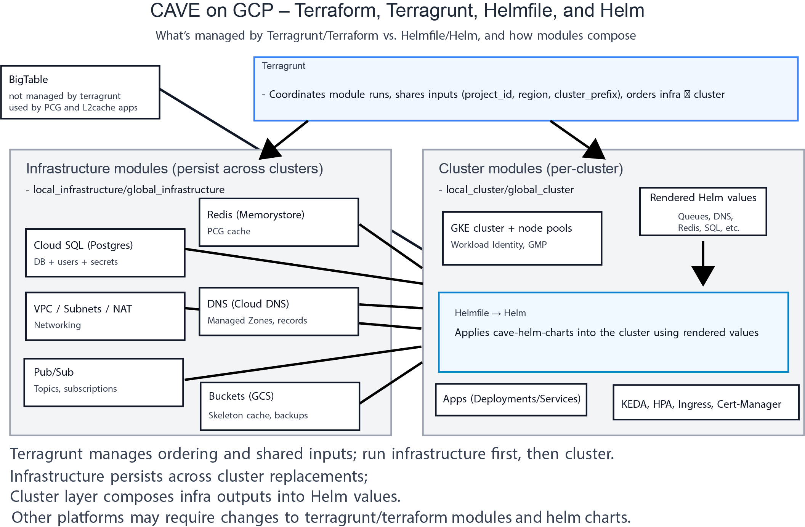

# terraform-google-cave
A repository to store terraform modules for setting up infrastructure as code for CAVE in google cloud

# setup
1. Install terraform
2. Install helm
3. make sure you can login to your google account, and you have a google project setup with the follwoing permissions on your account. 

service account user
kubernetes adminsitrator

4. This assumes you have setup bigtable and ingested some data into a table seperately.  This is currently managed by a seperate process documented and outlined in seung-lab/CAVEpipelines.  If you need to read more about how to format your segmentation result to be ingested look at thie markdown file [TODO: ADD LINK]

5. create a new environment in environments folder. Follow pattern found in example_environment.  Fill in values in the terraform.tfvars folder. 

Navigate to your environment folder with a terminal.

::
   terraform init

if this is a production environemnt, we reccomend setting up blue/green workspaces, so you can spin up a new workspace with no downtime when there are significant changes to the infrastructure beyond upgrading microservice versions. 

::
   terraform plan

If you have an existing deployment of CAVE that you would like to start managing with CAVE you will see a lot of resources being created here. To fix this you need to follow the instructions under the Migration section below. 

## How this repo fits with Helm charts

These Terraform modules are designed to be used alongside the Helm charts in the companion repository:

- Helm charts: https://github.com/CAVEconnectome/cave-helm-charts

High level workflow:
- Terragrunt orchestrates Terraform to provision and configure all infrastructure outside Kubernetes (SQL, Redis, networks, Pub/Sub, buckets, credentials, etc.).
- The Terraform modules render configuration values files/templates that feed into Helm/Helmfile so Kubernetes apps can connect to that external infrastructure.
- Helmfile then deploys the CAVE apps into the cluster using those values, referencing the cave-helm-charts repository.

Note: The Helm charts target Google Cloud (GKE) and Google Cloud services (e.g., Pub/Sub, GCS, Workload Identity). Other Kubernetes platforms may require adjustments; see the cave-helm-charts README for portability notes.

### Visual overview

See docs/architecture.svg for a high-level diagram of how Terragrunt, Terraform modules, Helmfile, and Helm fit together, including which layers persist across clusters and which are per-cluster.

## Module types and environments

For each environment/cluster, there are two kinds of Terraform modules, which we recommend coordinating with Terragrunt to share inputs and apply in order:

1) "infrastructure" – resources that should persist across Kubernetes clusters (e.g., databases, Redis, networks, buckets). This lets you spin up a new cluster version while reusing the same backend services.
2) "cluster" – the Kubernetes cluster and in-cluster prerequisites (e.g., GKE cluster, node pools, base addons) plus templating of app configuration values produced from infrastructure outputs.

Because CAVE has both global and local clusters, there will eventually be four modules:
- local_infrastructure
- local_cluster
- global_infrastructure
- global_cluster

Terragrunt is used to coordinate these modules, provide shared inputs (project, region, prefixes), and manage ordering.

## Cookiecutter and migration from legacy templates

If you are migrating from CAVEdeployment-style legacy templates, we provide a cookiecutter template to scaffold a Terragrunt environment repo and helpers to import existing "infrastructure" resources into Terraform/Terragrunt state. See `cookiecutter_templates/local_cave/` and the QUICKSTART for details.

## Migration from CAVEdeployment 
If you already have a deployment that used CAVEdeployment
to get existing resources properly mapped into terraform that were created outside of it you need to import them 
from the environment folder.

We have made two scripts to assist with this process. To use them navigate to your infrastrucutre directories ({{deployment_description}}/{{static}}), and then run ../scripts/import

### todo
1. for global figure out oauth secret integration with terragrutn or add to manual step before going to helm 
2. consider adding scalers to global deployments
3. write instructions about when/how to do the cavetoken thing with global and/or local
4. recheck how the postgres username/password flow is suppose to work and is well documented.
5. fix the CSRF secrets in info (maybe others too)
6. figure out AUTH secret key
7. fix the run_cloudsql_proxy.sh to work for helmfile
8. make a global cookiecutter template
9. need to get cluster_name, cluster_prefix, domain_name, all straight, how many do we want/need.. v5, api5, api, em.brain.allen-tech.org, etc. 
  cluster_prefix: api5
  domain_names:
    - api.em.allen-tech.org (production URL)
    - api5.em.allen-tech.org (automatically made)
  cluster_name: {{ cluster_prefix }}-cave

